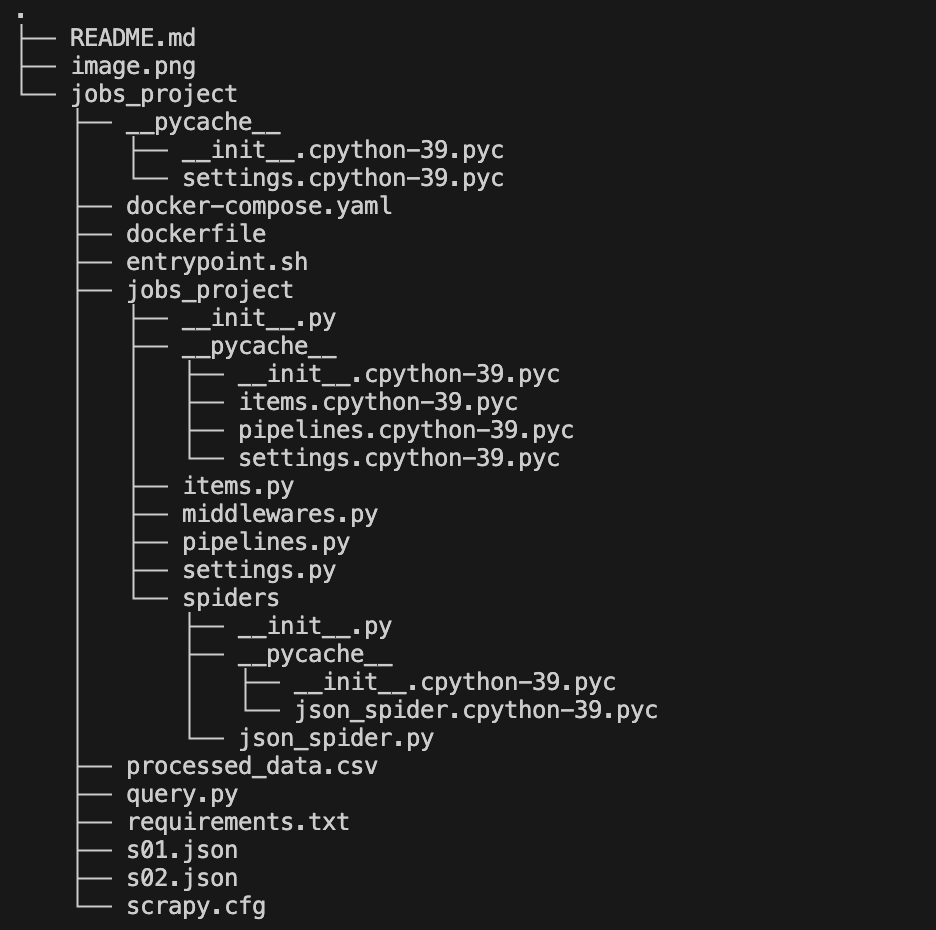
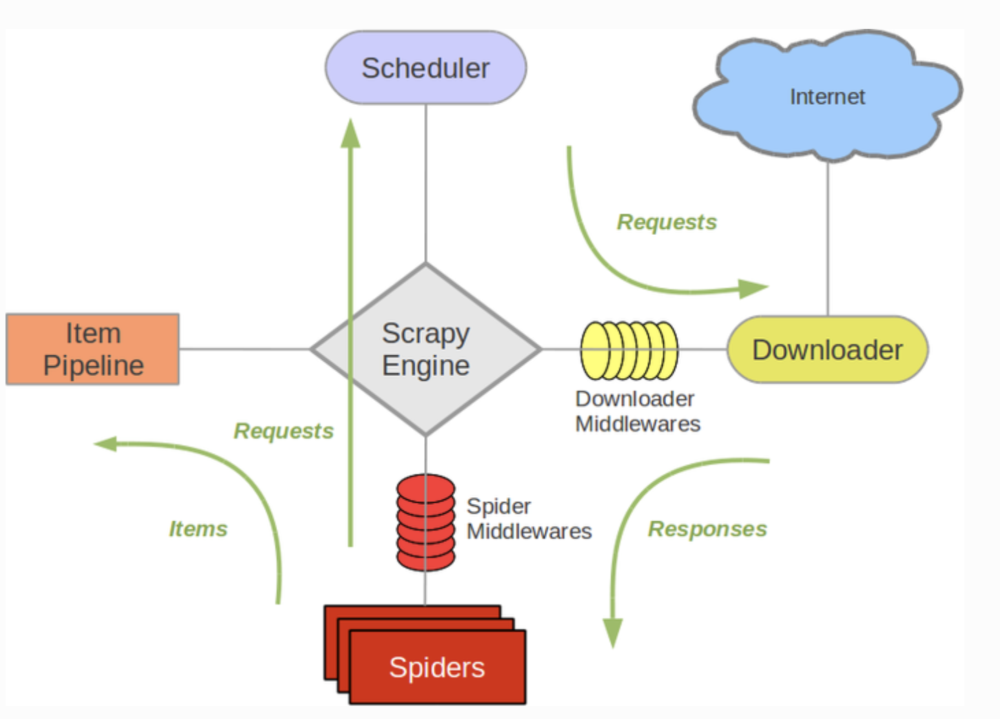

## Project Setup
1. Install Required Extensions
    - Python
    - Docker
    - PostgreSQL
    - MongoDB
    - GitLens
2. Create Project Structure
    ```
    mkdir scrapypipeline
    cd scrapypipeline
    scrapy startproject scrapypipeline
    touch docker-compose.yaml dockerfile query.py README.md requirements.txt
    touch scrapypipeline/spiders/json_spider.py
    ```
3. Configure the project
    - Install Docker Desktop for MacOS
    - Add Docker Compose to PATH
    ```
    vim ~/.zshrc
    export PATH=/usr/local/bin:$PATH
    source ~/.zshrc
    ```
    - Start Docker Daemon
    ```
    open /Applications/Docker.app
    ```
3. Start the project
    ```
    docker-compose up --build
    ```

## Project Structure


## Demo
https://drive.google.com/file/d/11MUFFUk5i3GB8H1vp0bskGa1nGnD8FkC/view?usp=drive_link

## Scrapy Engine Workflow
- Initialize Spider: Start with start_requests().
- Request Processing: Send initial requests to the scheduler.
- Download: Downloader fetches the web pages.
- Response Handling: Responses are sent back to the engine and then to the spider’s parse method.
- Data Extraction and Follow-up Requests: The parse method extracts data and generates new requests.
- Item Processing: Extracted items are sent to the item pipeline for further processing.
- Output: Finally, processed items are stored in PostSQL and other storage.

### Components of Scrapy

- Scheduler: The scheduler queues requests and feeds them to the Scrapy engine when it’s ready.
- Downloader: The downloader fetches the web pages and sends the responses back to the Scrapy engine.
- Spider: The spider processes the responses, extracts the data, and generates new requests if necessary.
This process is illustrated by the parse method, where items are extracted, and new requests are created using response.follow().
- Item Pipeline: Items extracted by the spider are sent through the item pipeline where they can be processed further (e.g., cleaned, validated, and stored in a database).
- Downloader Middlewares and Spider Middlewares: These are hooks that can modify requests and responses as they pass through the Scrapy engine.

## Acknowledge
- https://scrapy-cookbook.readthedocs.io/zh-cn/latest/scrapy-01.html
- https://scrapeops.io/python-scrapy-playbook/scrapy-save-data-postgres/